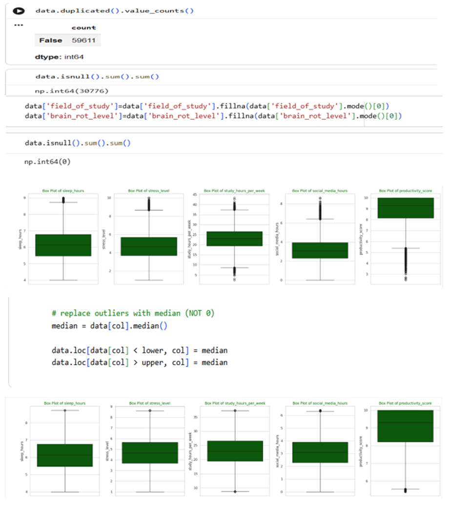
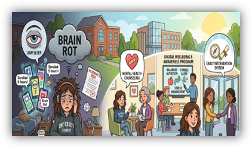
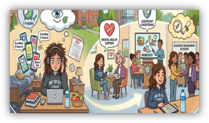
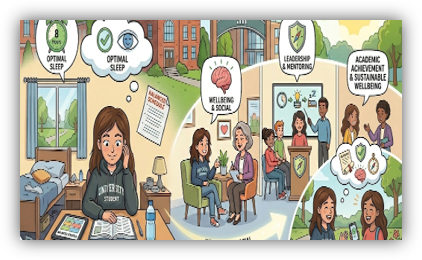
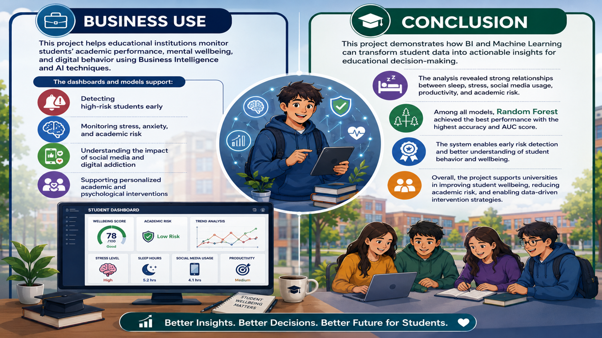

# 🎓 Smart Student Monitoring System

*Business Intelligence & AI-Powered Student Analytics Platform*

*Authors: Aya Jarrar, Zaina Saidi, Shaimaa Akarah*

---

## *📌 Project Overview*

The **Smart Student Monitoring System** is a Business Intelligence and Artificial Intelligence solution designed to analyze student academic performance, mental wellbeing, and digital behavior.

The project combines:

* Business Intelligence (Power BI)
* Data Analytics
* Machine Learning
* Student Segmentation

to help educational institutions identify students at risk, monitor wellbeing indicators, and support data-driven decision-making.

---

## *[**🎯 Project Objectives**](docs/smart.md#business-intelligence-project-description-and-objectives)*

* Analyze factors affecting academic performance and wellbeing.
* Detect students at high academic and psychological risk.
* Predict risk levels using Machine Learning.
* Segment students into behavioral groups using clustering.
* Develop interactive Power BI dashboards for decision support.

---

## *[**📊 Dataset**](docs/smart.md#data-description-and-understanding)*

The project uses:

### 1. Kaggle Dataset

Student Social Media Impact Dataset

### 2. Custom Survey

A Google Form survey distributed to university students covering:

* Academic stress
* Anxiety
* Depression
* Social pressure
* Family expectations
* Financial concerns
* Social media influence

### Dataset Characteristics

* **59,611 Records**
* **47 Features**

Key variables include:

* Study Hours
* Sleep Hours
* Academic Motivation
* Productivity Score
* Stress Level
* Anxiety Score
* Depression Score
* Wellbeing Index
* Social Media Usage
* Digital Addiction Score
* Brain Rot Index
* Academic Risk Score

---

## *[**🧹 Data Preparation**](docs/smart.md#data-primary-cleaning-and-transformation)*

Data preprocessing included:

* Missing value handling
* Duplicate removal
* Outlier detection
* Z-Score treatment
* Feature selection
* One-Hot Encoding
* Data transformation

These steps improved model accuracy and dashboard reliability.

---

## *[**📈 Key Insights**](docs/smart.md#pivot-tables)*

### Study Hours vs Academic Risk

Students with fewer study hours showed significantly higher academic risk levels.

### Sleep vs Mental Health

Lower sleep duration was associated with:

* Higher stress
* Higher anxiety
* Higher depression

### Social Media Impact

Students with excessive social media usage experienced:

* Higher academic risk
* Increased stress
* Lower productivity

### Cyberbullying

Students exposed to cyberbullying showed:

* Higher academic risk
* Higher financial risk
* Lower productivity

---

## *[**📊 Power BI Dashboards**](docs/smart.md#dashboard-design-&-business-insights)*

The project includes four interactive dashboards:

### 1. Student Academic Risk & Wellbeing Dashboard

Provides insights into:

* Academic Risk
* Stress Levels
* Wellbeing Index
* Student Distribution
* Country Comparison

---

### 2. Mental Health & Wellbeing Dashboard

Tracks:

* Stress
* Anxiety
* Depression
* Sleep Behavior
* Productivity

---

### 3. Digital Behavior & Academic Impact Dashboard

Analyzes:

* Social Media Usage
* Digital Addiction
* Brain Rot Index
* Attention Span
* Academic Risk

---

### 4. Academic Performance Dashboard

Measures:

* Productivity
* Attendance
* Study Hours
* Academic Risk

---

## *[**🤖 Machine Learning Models**](docs/smart.md#prediction)*

Three models were developed to predict student risk levels.

| Model               | Accuracy | AUC    |
| ------------------- | -------- | ------ |
| Logistic Regression | 82.5%    | 0.89   |
| Neural Network      | 84.0%    | 0.90   |
| Random Forest       | ⭐ 86.1%  | ⭐ 0.92 |

### Best Model: Random Forest

Why?

* Highest Accuracy
* Highest AUC
* Best High-Risk Student Detection
* Lowest False Negatives

Key influencing factors:

* Stress Level
* Sleep Hours
* Academic Motivation
* Productivity Score
* Social Media Usage
* Digital Addiction Score

---

## *[**👥 Student Clustering**](docs/smart.md#clustering)*

K-Means Clustering was applied to identify behavioral student groups.

### Cluster 0 — High Risk Students

Characteristics:

* Low Sleep Hours
* High Social Media Usage
* High Stress & Anxiety
* Low Wellbeing

Recommended Actions:

* Counseling Programs
* Academic Advising
* Digital Wellness Campaigns

---

### Cluster 1 — Healthy & Productive Students

Characteristics:

* High Study Hours
* Strong Productivity
* Good Sleep Habits
* Low Stress

Recommended Actions:

* Leadership Programs
* Mentoring Initiatives
* Academic Excellence Support

---

### Cluster 2 — Balanced Students

Characteristics:

* Healthy Lifestyle Balance
* Low Stress
* High Wellbeing

Recommended Actions:

* Preventive Wellbeing Programs
* Healthy Digital Behavior Promotion

---

## *[**💻 Technologies Used**](docs/smart.md#tools-research-and-selection-effort)*

### Programming & Analytics

* Python
* Google Colab
* Pandas
* NumPy
* Scikit-Learn
* Matplotlib
* Seaborn

### Business Intelligence

* Microsoft Power BI

### Machine Learning

* Logistic Regression
* Random Forest
* Neural Networks
* K-Means Clustering

---

## *[**🚀 Business Value**](docs/smart.md#project-deployment-effort---use-case)*

The system enables educational institutions to:

* Detect at-risk students early
* Improve academic support services
* Monitor student wellbeing
* Reduce academic failure risks
* Support data-driven educational decisions
* Promote healthier digital habits

This project was developed for academic and educational purposes as part of the Graduation Project at the University of Petra.
