Smart Student Monitoring System

Authors

Aya Jarrar, Zaina Saidi, &

Shaimaa Akarah

202210914, 202210390, &

202210975

Supervised by

Dr Ayman Mansour

Course: 307498 - Graduation Project

Second Semester, 2025/2026

---

Contents

[**Abstract** 3](#_Toc230731221)

[**Acknowledgment** 4](#_Toc230731222)

[**Business Intelligence Project Description and Objectives** 5](#_Toc230731223)

[**Data Research and Acquiring Effort** 6](#_Toc230731224)

[**Data Description and Understanding** 7](#_Toc230731225)

[**Data Dictionary** 7](#_Toc230731226)

[**Exploratory Data Analysis (EDA)** 10](#_Toc230731227)

[**Data Primary Cleaning and Transformation** 11](#_Toc230731228)

[**Data Visualization and Insights** 13](#_Toc230731229)

[**Descriptive statistics** 13](#_Toc230731230)

[**Column Distribution** 15](#_Toc230731231)

[**Pivot Tables** 17](#_Toc230731232)

[**Dashboard Design & Business Insights** 20](#_Toc230731233)

[**Advanced Analytics and AI Modeling** 29](#_Toc230731234)

[**Prediction** 30](#_Toc230731235)

[**Clustering** 34](#_Toc230731236)

[**Tools Research and Selection Effort** 36](#_Toc230731237)

[**Project Deployment Effort - Use Case** 37](#_Toc230731238)

[**Results** 38](#_Toc230731239)

[**References** 38](#_Toc230731240)

---

# *Abstract*

This project investigates the application of Business Intelligence, data analytics, and machine learning techniques to analyze students' academic performance, mental wellbeing, and digital behavior in educational environments. The study aims to support data-driven decision-making by identifying the factors affecting academic risk, stress levels, productivity, wellbeing, and digital addiction among students. The project focuses on analyzing student demographics, academic behavior, lifestyle habits, mental health indicators, and online activity patterns to uncover relationships between digital behavior, psychological wellbeing, and academic performance.

The implementation phase involved data cleaning, preprocessing, transformation, and exploration data analysis using Python and Google Colab. Interactive dashboards were developed in Microsoft Power BI to visualize academic risk levels, stress and wellbeing indicators, digital addiction patterns, productivity trends, study behavior, and student segmentation insights. Predictive analytics were conducted using Logistic Regression, Random Forest, and Neural Network models in Python and Google Colab to predict students' academic risk levels based on academic, psychological, and digital behavior factors. Model performance was evaluated using classification metrics including accuracy, precision, recall, F1-score, confusion matrix analysis, ROC Curve, and AUC Score. In addition, clustering techniques were applied to segment students into distinct behavioral groups based on stress levels, study habits, productivity, sleep behavior, and digital addiction indicators.

The results demonstrate that the predictive models achieved strong classification performance, with the Random Forest model outperforming the other models by capturing more complex relationships between student-related variables. Analysis revealed that stress level, sleep hours, social media usage, productivity score, academic motivation, and digital addiction score were among the most influential factors affecting academic risk levels. Furthermore, clustering analysis identified meaningful student groups such as highly productive students, high-risk students, digitally addicted students, and students experiencing elevated stress and low wellbeing, enabling educational institutions to improve academic support, mental health monitoring, and early intervention strategies. Overall, the integration of descriptive analytics, predictive modeling, clustering, and business intelligence dashboards within a unified framework proved effective in delivering actionable insights, improving student wellbeing, supporting academic success, and enhancing educational decision-making through early risk detection systems.

---

# *Acknowledgment*

First and foremost, we would like to thank Allah for giving us the strength, patience, and determination to successfully complete this project and overcome all challenges throughout this journey.

We would like to express our sincere gratitude to our professor and academic supervisor for their invaluable guidance, continuous support, and constructive feedback throughout the development of this project. Their expertise, encouragement, and dedication played a significant role in improving the quality of this work and enhancing our knowledge in the fields of Business Intelligence, Data Analytics, and Machine Learning.

We would also like to extend our deepest appreciation to our families and friends for their constant encouragement, patience, motivation, and emotional support during every stage of this project. Their support gave us confidence and determination to continue working toward achieving our goals.

Special thanks are also extended to the faculty and staff members whose commitment to academic excellence created a supportive learning environment that encouraged learning, innovation, critical thinking, and the practical application of analytical and technical skills.

Finally, we would like to thank everyone who contributed directly or indirectly to the success of this project. Your support and encouragement have had a meaningful impact on both our academic and personal growth.

---

# *Business Intelligence Project Description and Objectives*

*Project Description and Goal*

This project focuses on applying Business Intelligence, data analytics, and machine learning techniques to analyze students' academic performance, mental wellbeing, and digital behavior within educational environments. The project aims to transform raw student-related data into meaningful insights through descriptive analytics, predictive modeling, and clustering techniques.

The study analyzes student demographics, academic behavior, study habits, productivity, stress levels, sleep patterns, social media usage, digital addiction indicators, and wellbeing measures to better understand the factors affecting academic risk and student performance. Using Python, Google Colab, and Microsoft Power BI, the project demonstrates how data-driven approaches can support educational institutions in improving academic monitoring, student wellbeing, early intervention systems, and decision-making processes.

Interactive dashboards, predictive machine learning models, and clustering techniques were implemented to provide intelligent insights related to student behavior, mental health, academic performance, and digital lifestyle patterns.

*Project Objectives*

- Analyze student data to identify patterns affecting academic risk, productivity, stress levels, wellbeing, and digital addiction.
- Develop Logistic Regression, Random Forest, and Neural Network models to predict students' academic risk levels based on academic, psychological, and digital behavior factors.
- Identify the key factors influencing academic performance and student wellbeing, such as stress level, sleep hours, academic motivation, productivity, social media usage, and digital addiction.
- Apply clustering techniques to segment students into behavioral groups based on academic habits, mental health indicators, productivity, and digital behavior patterns.
- Design interactive Microsoft Power BI dashboards to support data-driven educational decision-making, student monitoring, and early intervention strategies.

---

# *Data Research and Acquiring Effort*

The data used in this project was obtained from a publicly available dataset on Kaggle and focuses on student academic performance, mental wellbeing, and digital behavior analysis. The primary objective during the data acquisition phase was to obtain data that accurately represents students' academic habits, psychological wellbeing, lifestyle behavior, and online activity patterns in order to support early detection of academic risk and student performance decline.

The selected dataset contains detailed information about student demographics, education level, field of study, study habits, productivity, stress levels, sleep patterns, social media usage, digital addiction indicators, wellbeing scores, attention span, and academic risk measures. The dataset was selected because it provides comprehensive information required for descriptive analytics, predictive modeling, clustering analysis, and business intelligence dashboard development.

The dataset was imported into Python, Google Colab, and Microsoft Power BI for data cleaning, preprocessing, transformation, visualization, and machine learning implementation. Several preprocessing steps were performed to handle missing values, remove inconsistencies, encode categorical variables, detect outliers, and improve overall data quality for analysis and predictive modeling.

The use of student behavioral and academic data enabled a comprehensive analysis of academic performance, mental health, and digital lifestyle patterns through descriptive analytics, predictive modeling, and clustering techniques. This supports the development of data-driven educational strategies that can help educational institutions improve student monitoring, enhance academic support systems, detect high-risk students early, improve mental wellbeing, and support effective educational decision-making.

A questionnaire survey was designed and distributed to university students to collect additional data related to students' mental health, academic stress, social pressure, and psychological wellbeing. The survey aimed to better understand the challenges students face during their academic life and how factors such as social media influence, family expectations, financial pressure, academic workload, bullying, and fear of the future affect their mental and academic wellbeing.

The questionnaire included demographic information such as age and college, in addition to multiple Likert-scale questions ranging from 1 to 5 to measure students' stress, anxiety, emotional pressure, and social challenges. The collected responses supported the analytical phase of the project by providing behavioral and psychological insights that were integrated into the business intelligence dashboards, prediction models, and clustering analysis.

---

# *Data Description and Understanding*

## *Data Dictionary*

The dataset used in this project contains student demographic, academic, mental health, and digital behavior information used to analyze academic risk, productivity, wellbeing, stress levels, study habits, and digital addiction patterns. The dataset includes variables related to study hours, attendance, motivation, sleep behavior, social media usage, anxiety, depression, and academic performance to support descriptive analytics, predictive modeling, clustering analysis, and business intelligence dashboard development.

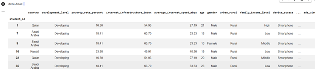

Number of Rows 59611 Number of Columns 47.

| Column Name                 | Description                                | Use                                                                  |
| --------------------------- | ------------------------------------------ | -------------------------------------------------------------------- |
| student_id                  | Unique identifier for each student         | Used to uniquely identify student records                            |
| age                         | Age of the student                         | Helps analyze student demographics and age-related behavior          |
| gender                      | Gender of the student                      | Used for demographic and behavioral analysis                         |
| country                     | Country of the student                     | Supports geographic and regional analysis                            |
| education_level             | Student education level                    | Used to compare academic performance across educational stages       |
| field_of_study              | Student major or academic specialization   | Helps analyze performance across different fields                    |
| study_hours_per_week        | Weekly study hours                         | Used to evaluate study behavior and academic engagement              |
| online_learning_hours       | Hours spent on online learning             | Used to analyze academic engagement in digital environments          |
| class_attendance_rate       | Student attendance percentage              | Helps analyze attendance impact on academic performance              |
| academic_motivation         | Level of academic motivation               | Used to measure student engagement and learning motivation           |
| productivity_score          | Student productivity level                 | Used to evaluate academic efficiency and performance                 |
| academic_risk_score         | Risk level of poor academic performance    | Target variable used for predictive modeling and risk analysis       |
| sleep_hours                 | Average daily sleep hours                  | Used to analyze the relationship between sleep and wellbeing         |
| stress_level                | Student stress level                       | Helps evaluate psychological pressure and mental health              |
| anxiety_score               | Student anxiety level                      | Used for mental health and wellbeing analysis                        |
| depression_score            | Student depression level                   | Helps analyze emotional wellbeing and psychological condition        |
| wellbeing_index             | Overall student wellbeing score            | Used to evaluate mental and emotional health                         |
| attention_span_minutes      | Average attention span                     | Used to evaluate concentration and focus levels                      |
| social_media_hours          | Daily social media usage hours             | Used to analyze digital behavior and addiction patterns              |
| social_media_usage          | Social media activity level                | Helps analyze social media impact on academic performance            |
| screen_time                 | Total screen usage time                    | Helps evaluate digital lifestyle impact on students                  |
| internet_access_hours       | Daily internet usage hours                 | Used to analyze internet dependency and online behavior              |
| sessions_per_day            | Number of daily online sessions            | Used to measure online activity intensity                            |
| short_video_hours           | Time spent watching short videos           | Helps analyze attention and digital consumption behavior             |
| entertainment_content_hours | Time spent on entertainment content        | Used to analyze distraction and non-educational digital activity     |
| education_content_hours     | Time spent on educational content          | Helps compare productive and non-productive digital usage            |
| late_night_usage            | Indicates late-night online activity       | Used to analyze unhealthy digital and sleep habits                   |
| late_night_score            | Score representing late-night activity     | Helps evaluate late-night digital behavior patterns                  |
| brain_rot_index             | Indicator of excessive digital consumption | Used to measure digital overload behavior                            |
| digital_addiction_score     | Student digital addiction level            | Helps analyze technology dependency and academic impact              |
| cyberbullying_exposure      | Exposure to cyberbullying                  | Helps analyze online psychological and social risks                  |
| financial_risk_score        | Student financial risk indicator           | Used to analyze external factors affecting wellbeing and performance |

---

# *Exploratory Data Analysis (EDA)*

Initial Exploratory Data Analysis (EDA) was performed to understand the structure, distribution, and behavioral patterns of the student dataset before applying predictive and clustering models. Various charts, visualizations, and statistical summaries were used to uncover patterns, trends, and anomalies related to academic risk, mental wellbeing, productivity, stress levels, and digital addiction.

Histograms and descriptive statistics were applied to numerical variables such as study hours, sleep hours, productivity score, stress level, wellbeing index, social media usage, and digital addiction score. The analysis revealed variations in student academic performance, mental health, and online behavior across different student groups. Box plots for stress level, social media usage, and academic risk score identified the presence of outliers, indicating students with unusually high stress levels, excessive digital usage, or elevated academic risk.

Bar charts and pivot tables were used to analyze categorical variables such as gender, education level, field of study, and risk categories. The analysis showed that some student groups experience higher academic risk, lower wellbeing, and higher digital addiction levels compared to others. Student behavioral analysis also revealed differences in productivity, study habits, and mental health indicators across educational levels and academic specializations.

Scatter plots between sleep hours and stress level demonstrated a negative relationship, indicating that students with lower sleep hours tend to experience higher stress levels. Additional analysis between social media usage and academic risk suggested that excessive digital activity is associated with higher academic risk and lower productivity.

Overall, the EDA phase provided valuable insights into student behavior, academic performance, mental wellbeing, and digital lifestyle patterns. It also identified high-risk student groups and guided feature selection for predictive modeling and clustering analysis. These findings directly support the project's objective of improving student monitoring, detecting academic risk early, supporting mental wellbeing, and enabling data-driven educational decision-making through Business Intelligence and machine learning techniques.

---

# *Data Primary Cleaning and Transformation*

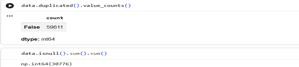
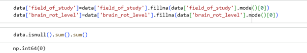
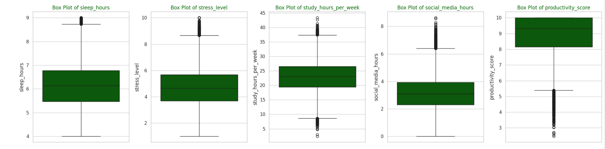
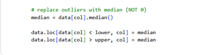
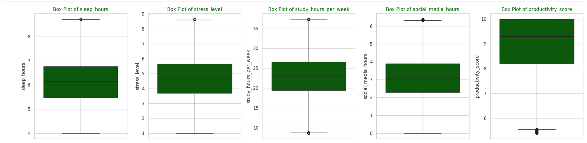

*Main Cleaning Steps*

• Checked missing values and duplicate records; no duplicate rows were found.  
• Filled missing values in columns such as _field_of_study_ and _brain_rot_level_ using the mode value.  
• Used boxplots to detect outliers in variables such as sleep hours, stress level, study hours per week, social media hours, and productivity score.  
• Applied Z-Score and capping techniques to treat outliers and reduce the impact of extreme values.  
• Selected important features related to academic performance, mental wellbeing, productivity, social media usage, and digital addiction.  
• Encoded categorical variables and prepared the dataset for machine learning models and dashboard analysis.

*Purpose*

These preprocessing steps improved data quality and ensured the dataset was ready for exploratory analysis, predictive modeling, clustering, and interactive Power BI dashboards to support academic risk analysis, student wellbeing monitoring, and data-driven educational decision-making.

---

# *Data Visualization and Insights*

## *Descriptive statistics*

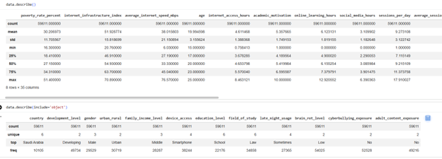

Numerical Variables _(data.describe())_

The first table summarizes the numerical columns in the dataset using statistical measures such as count, mean, standard deviation, minimum, maximum, and percentiles. Most numerical columns contain 59,611 records, indicating high data consistency and completeness across the dataset.

The analysis shows that the average student age is approximately 20 years, while the average internet access time is around 4.6 hours per day. Students spend an average of 6.1 hours on online learning and approximately 3.1 hours on social media daily. The average number of online sessions per day is about 9 sessions, indicating high levels of digital activity among students.

The dataset also shows variation across behavioral and academic variables. For example, academic motivation has an average score of approximately 5.35, while internet infrastructure index and internet speed vary significantly across countries. Percentile analysis helped understand the distribution of student behavior and academic engagement levels within the dataset.

This analysis provides insights into student academic habits, online learning behavior, digital activity, and internet accessibility patterns, which support academic risk analysis and wellbeing evaluation.

Categorical Variables _(data.describe(include='object'))_

The second table summarizes categorical variables such as country, development level, gender, urban/rural area, family income level, device access, education level, field of study, brain rot level, and cyberbullying exposure.

The analysis shows that:

- Saudi Arabia is the most common country in the dataset.
- Most students belong to developing countries.
- Male students represent the largest gender group.
- Urban students appear more frequently than rural students.
- Smartphones are the most used devices for internet access.
- School-level education is the most common education category.
- Law is the most frequent field of study.
- Most students fall under the low brain rot level category.
- The majority of students reported no cyberbullying or adult content exposure.

The frequency analysis highlights dominant student demographic and behavioral patterns, helping identify the most common educational, technological, and digital lifestyle characteristics within the dataset.

Purpose

Descriptive statistics help identify data distributions, dominant categories, behavioral patterns, and potential relationships between academic performance, wellbeing, and digital activity. These insights support exploration data analysis, feature selection, predictive modeling, clustering analysis, and interactive Power BI dashboard development.

---

## *Column Distribution*

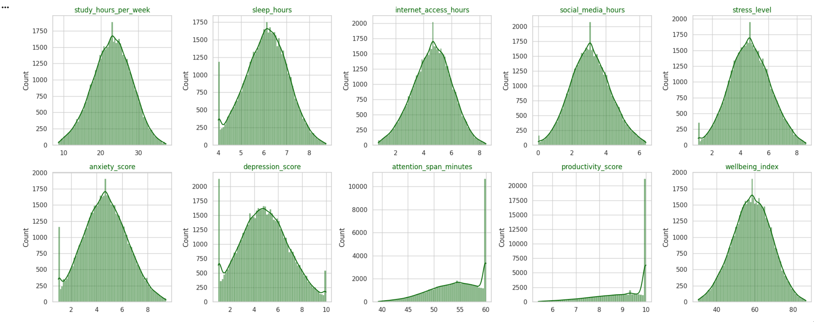

- Study Hours per Week Distribution:  
   Study hours are concentrated around moderate to high ranges, with most students studying between approximately 18-28 hours weekly.  
   Business Use: Helps evaluate student study behavior and academic engagement.  
   Contribution: Supports analysis of academic performance and productivity patterns.
- Sleep Hours Distribution:  
   Sleep hours follow a near-normal distribution centered around 6 hours per day, with some students showing lower sleep patterns.  
   Business Use: Helps monitor student lifestyle and wellbeing habits.  
   Contribution: Supports analysis of sleep impact on stress, productivity, and academic risk.
- Internet Access Hours Distribution:  
   Most students spend around 4-6 hours daily accessing the internet.  
   Business Use: Measures internet dependency and digital activity levels.  
   Contribution: Supports analysis of online behavior and digital lifestyle patterns.
- Social Media Hours Distribution:  
   Social media usage is concentrated around moderate daily usage levels, with some students showing excessive usage behavior.  
   Business Use: Helps evaluate social media consumption among students.  
   Contribution: Supports analysis of digital addiction and academic risk relationships.
- Stress Level Distribution:  
   Stress levels are distributed around moderate values, while a smaller group of students experience high stress levels.  
   Business Use: Helps monitor student mental wellbeing and psychological pressure.  
   Contribution: Supports analysis of stress impact on productivity and academic performance.
- Anxiety Score Distribution:  
   Anxiety scores show moderate variation across students, with most values centered around medium anxiety levels.  
   Business Use: Helps evaluate student emotional wellbeing.  
   Contribution: Supports mental health and wellbeing analysis.
- Depression Score Distribution:  
   Depression scores follow a broad distribution, indicating differences in student emotional conditions and psychological wellbeing.  
   Business Use: Helps identify students with elevated mental health concerns.  
   Contribution: Supports analysis of emotional wellbeing and academic risk factors.
- Attention Span Minutes Distribution:  
   Most students have attention spans concentrated between approximately 50-60 minutes.  
   Business Use: Helps evaluate focus and concentration behavior.  
   Contribution: Supports analysis of productivity and learning efficiency.
- Productivity Score Distribution:  
   Productivity scores are highly concentrated around high-performance levels close to the maximum score.  
   Business Use: Helps evaluate overall student academic productivity.  
   Contribution: Supports analysis of factors affecting student efficiency and performance.
- Wellbeing Index Distribution:  
   The wellbeing index follows a balanced distribution centered around moderate to high wellbeing levels.  
   Business Use: Helps monitor overall student mental and emotional wellbeing.  
   Contribution: Supports wellbeing analysis and academic support decision-making.

---

## *Pivot Tables*

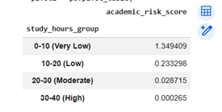

Average Academic Risk Score by Study Hours Group

The pivot table compares the average academic risk score across different study hour groups. The results show that students with very low study hours (0-10 hours) have the highest academic risk scores, while students with higher study hours demonstrate significantly lower academic risk levels. Students studying between 30-40 hours per week show the lowest academic risk values.

Business Use: Helps educational institutions identify how study behavior influences academic performance and student risk levels.

Contribution: Supports early detection of academically at-risk students and helps improve academic support strategies through study habit analysis.

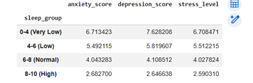

Average Anxiety, Depression, and Stress Levels by Sleep Group

The pivot table compares average anxiety score, depression score, and stress level across different sleep hour groups. The results show that students with very low sleep hours (0-4 hours) experience the highest anxiety, depression, and stress levels. As sleep duration increases, mental health indicators improve significantly, with students sleeping between 8-10 hours showing the lowest stress, anxiety, and depression scores.

Business Use: Helps educational institutions understand the relationship between sleep behavior and student mental wellbeing.

Contribution: Supports early identification of students at psychological risk and helps improve wellbeing support strategies through healthy sleep habit analysis.

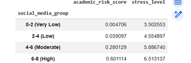

Average Academic Risk Score and Stress Level by Social Media Usage Group

The pivot table compares the average academic risk score and stress level across different social media usage groups. The results show that students with higher social media usage experience significantly higher academic risk and stress levels. Students in the 6-8 hour group have the highest academic risk and stress values, while students with very low social media usage (0-2 hours) show the lowest risk and stress levels.

Business Use: Helps educational institutions understand the impact of excessive social media usage on student wellbeing and academic performance.

Contribution: Supports early detection of high-risk students and helps develop strategies to reduce digital addiction and improve academic outcomes.

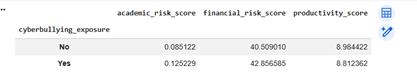

Average Academic Risk, Financial Risk, and Productivity Score by Cyberbullying Exposure

The pivot table compares the average academic risk score, financial risk score, and productivity score based on cyberbullying exposure. The results show that students exposed to cyberbullying have higher academic and financial risk scores compared to students who were not exposed. In addition, students experiencing cyberbullying demonstrate slightly lower productivity levels.

Business Use: Helps educational institutions understand the impact of cyberbullying on student wellbeing, academic performance, and productivity.

Contribution: Supports early identification of vulnerable students and helps improve mental health support, online safety awareness, and student protection strategies.

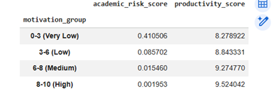

Average Academic Risk Score and Productivity Score by Motivation Group

The pivot table compares the average academic risk score and productivity score across different academic motivation groups. The results show that students with very low motivation levels have the highest academic risk scores and lower productivity levels. As motivation levels increase, academic risk decreases significantly while productivity scores improve. Students with high motivation levels demonstrate the lowest academic risk and the highest productivity levels.

Business Use: Helps educational institutions understand the impact of academic motivation on student performance and productivity.

Contribution: Supports early identification of low-motivation students and helps improve academic support strategies, engagement programs, and student performance outcomes.

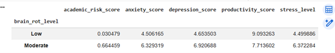

Average Academic Risk, Anxiety, Depression, Productivity, and Stress Levels by Brain Rot Level

The pivot table compares the average academic risk score, anxiety score, depression score, productivity score, and stress level across different brain rot levels. The results show that students with moderate brain rot levels experience significantly higher academic risk, anxiety, depression, and stress levels compared to students with low brain rot levels. In addition, students with moderate brain rot levels demonstrate noticeably lower productivity scores.

Business Use: Helps educational institutions understand the impact of excessive digital consumption and unhealthy online behavior on student mental wellbeing and academic performance.

Contribution:Supports early detection of students affected by digital overload and helps improve digital wellness programs, mental health support, and academic intervention strategies.

---

## *Dashboard Design & Business Insights*

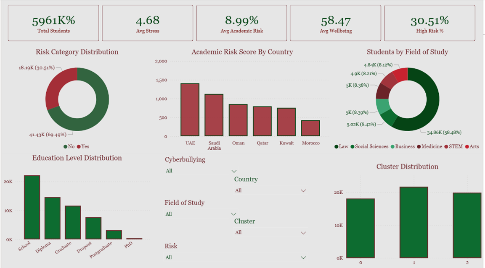

Student Academic Risk & Wellbeing Dashboard

Dashboard Purpose

This dashboard analyzes students' academic performance, stress levels, wellbeing, study behavior, and academic risk across different countries, education levels, and fields of study. It helps educational institutions identify students at risk of academic decline or psychological distress and supports early intervention and decision-making strategies.

KPI Cards

- Total Students
- Average Stress Level
- Average Academic Risk
- Average Wellbeing Index
- High-Risk Student Percentage

Business Use: Provides a quick overview of students' academic and mental wellbeing status, helping universities and counselors monitor overall student performance and identify critical risk levels.

Risk Category Distribution (Donut Chart)

Shows the percentage distribution of students across academic risk categories such as High Risk and Low Risk.

Business Use: Help institutions understand the proportion of students requiring academic or psychological support and evaluate overall academic stability.

Academic Risk Score by Country (Bar Chart)

Displays the average academic risk score across different Arab countries.

Business Use: Identifies countries with higher academic risk levels and supports regional educational analysis and targeted intervention strategies.

Students by Field of Study (Donut Chart)

Shows the distribution of students across different academic majors such as Law, Business, STEM, Medicine, Arts, and Social Sciences.

Business Use: Helps analyze student representation across majors and identify fields that may experience higher academic pressure or risk.

Education Level Distribution (Column Chart)

Displays the number of students across different education levels such as School, Diploma, Graduate, Postgraduate, and PhD.

Business Use: Supports demographic analysis and helps identify which education levels contain larger or more vulnerable student populations.

Cluster Distribution (Column Chart)

Shows the number of students within each cluster generated using clustering techniques based on academic and behavioral characteristics.

Business Use: This supports targeted academic support and personalized intervention strategies.

Interactive Filters (Slicers)

The dashboard includes interactive filters for:

- Cyberbullying Exposure
- Country
- Field of Study
- Cluster
- Risk Category

Business Use: Allows users to dynamically explore student behavior, academic performance, and wellbeing across different groups and conditions.

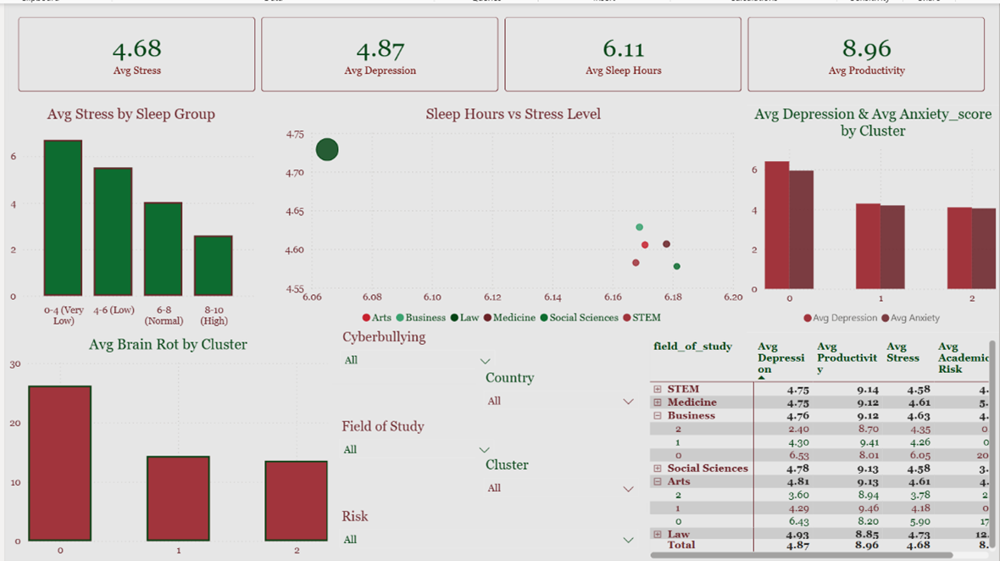

Mental Health & Wellbeing Dashboard

Dashboard Purpose

This dashboard analyzes students' mental wellbeing, stress levels, depression, sleep behavior, productivity, and digital addiction patterns across different academic clusters and fields of study. It helps educational institutions identify psychological risk factors affecting students' academic performance and overall wellbeing.

KPI Cards

- Average Stress Level
- Average Depression Score
- Average Sleep Hours
- Average Productivity Score

Business Use; Provides a quick overview of students' psychological wellbeing and academic productivity, helping counselors and universities monitor mental health conditions and identify students requiring support.

Average Stress by Sleep Group (Column Chart)

Shows the average stress level across different sleep duration groups.

Business Use; Help analyze the relationship between sleep behavior and stress levels. The results indicate that students with lower sleep hours tend to experience higher stress levels, supporting early wellbeing monitoring.

Sleep Hours vs Stress Level (Bubble Chart)

Displays the relationship between average sleep hours and stress levels across different fields of study.

Business Use: Helps identify how sleep patterns influence student stress across academic majors and supports understanding of academic pressure differences between fields.

Average Depression & Anxiety Score by Cluster (Clustered Column Chart)

Compares average depression and anxiety levels across student clusters generated using clustering techniques.

Business Use: Helps identify psychologically vulnerable student groups and support targeted mental health interventions and counseling strategies.

Average Brain Rot Index by Cluster (Column Chart)

Shows the average brain rot index for each student cluster.

Business Use: Measures excessive digital consumption and identifies clusters with higher digital addiction behavior that may negatively affect concentration, wellbeing, and academic performance.

Academic & Mental Health Summary Table

Displays detailed comparisons across fields of study and clusters using:

- Average Depression
- Average Productivity
- Average Stress
- Average Academic Risk

Business Use: Supports detailed academic and psychological analysis by comparing student performance and wellbeing across different majors and behavioral clusters.

Interactive Filters (Slicers)

- Cyberbullying Exposure
- Country
- Field of Study
- Cluster
- Risk Category

Business Use: Allows users to dynamically explore mental health patterns, academic stress, and digital behavior across different student groups and conditions.

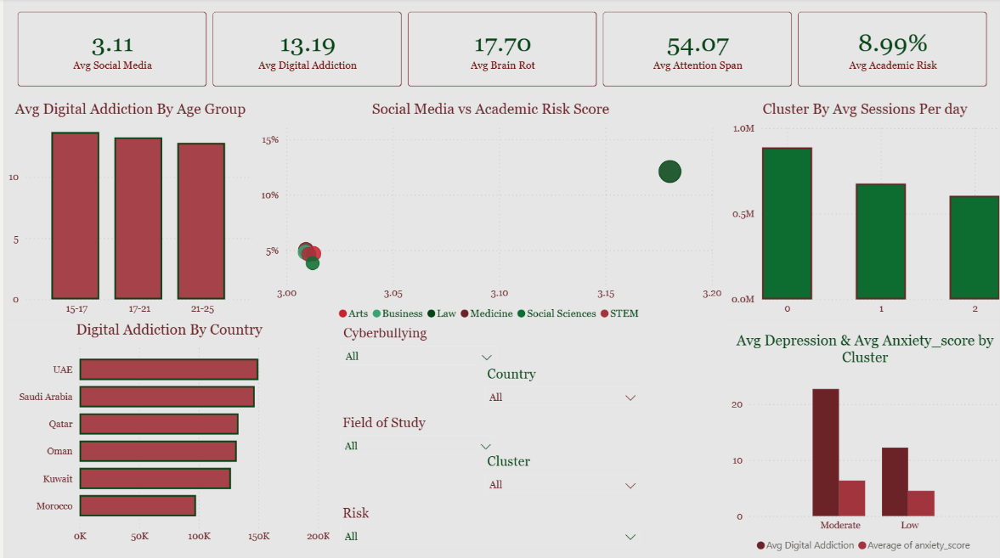

Digital Behavior & Academic Impact Dashboard

Dashboard Purpose

This dashboard analyzes students' digital behavior, social media usage, digital addiction, attention span, brain rot levels, and their impact on academic risk and mental wellbeing. It helps educational institutions understand how excessive digital consumption affects student performance, concentration, and psychological health.

KPI Cards

- Average Social Media Hours
- Average Digital Addiction Score
- Average Brain Rot Index
- Average Attention Span
- Average Academic Risk

Business Use: Provides a quick overview of students' digital habits and their potential impact on academic performance and wellbeing, supporting data-driven educational and psychological intervention strategies.

Average Digital Addiction by Age Group (Column Chart)

Shows the average digital addiction score across different age groups.

Business Use: Help identify which student age groups are more vulnerable to excessive digital behavior and support targeted awareness and intervention programs.

Social Media vs Academic Risk Score (Bubble Chart)

Displays the relationship between social media usage and academic risk score across different fields of study.

Business Use: Helps analyze whether higher social media usage contributes to increased academic risk and identifies majors more affected by digital distraction.

Cluster by Average Sessions Per Day (Column Chart)

Shows the average number of daily digital sessions across student clusters.

Business Use: Identifies clusters with excessive online activity and helps detect behavioral patterns related to digital addiction and reduce academic focus.

Digital Addiction by Country (Horizontal Bar Chart)

Displays average digital addiction levels across Arab countries included in the study.

Business Use: Supports regional comparison of digital behavior and helps identify countries with higher digital dependency among students.

Average Digital Addiction & Anxiety Score by Cluster (Clustered Column Chart)

Compares digital addiction levels and anxiety scores across student clusters.

Business Use: Help identify the relationship between excessive digital behavior and psychological stress indicators, supporting mental health monitoring and intervention strategies.

Interactive Filters (Slicers)

- Cyberbullying Exposure
- Country
- Field of Study
- Cluster
- Risk Category

Business Use: Allow users to dynamically analyze digital behavior, academic risk, and psychological wellbeing across different student groups and conditions.

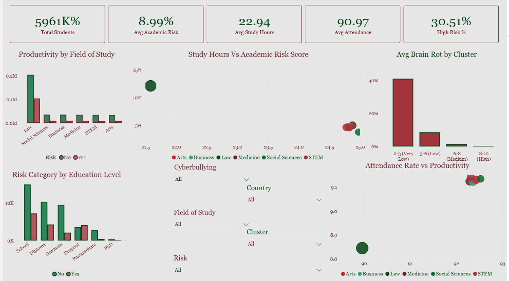

Academic Risk & Student Performance Dashboard

Dashboard Purpose

This dashboard analyzes students' academic performance, study behavior, productivity, attendance, and academic risk levels across different fields of study and student clusters. It helps educational institutions identify factors affecting academic success and detect students with higher academic risk.

KPI Cards

- Total Students
- Average Academic Risk Score
- Average Study Hours
- Average Attendance Rate
- High-Risk Students Percentage

Business Use: Provides a quick overview of overall student performance and academic risk levels, helping universities and educational institutions monitor student outcomes and identify students requiring academic support.

Productivity by Field of Study (Column Chart)

Displays productivity levels across different academic majors such as Law, Business, Medicine, STEM, Arts, and Social Sciences.

Business Use: Helps compare student productivity between different fields of study and identify majors with stronger academic performance.

Study Hours vs Academic Risk Score (Bubble Chart)

Shows the relationship between average study hours and academic risk score across different academic fields.

Business Use: Help analyze how study behavior influences academic risk. The results indicate that students with lower study hours generally experience higher academic risk levels.

Average Brain Rot by Cluster (Column Chart)

Displays the average brain rot level across different motivation or behavioral groups.

Business Use: Helps identify student groups with higher digital distraction and excessive online behavior that may negatively affect concentration and academic performance.

Risk Category by Education Level (Column Chart)

Compares academic risk categories across different education levels such as School, Diploma, Graduate, Postgraduate, and PhD.

Business Use: Supports analysis of how education level affects academic risk and helps identify educational groups requiring additional academic support.

Attendance Rate vs Productivity (Bubble Chart)

Displays the relationship between attendance rates and productivity scores across fields of study.

Business Use: Help evaluate the impact of attendance on academic productivity. The analysis shows that students with higher attendance rates generally achieve better productivity scores.

Interactive Filters (Slicers)

- Cyberbullying Exposure
- Country
- Field of Study
- Cluster
- Risk Category

Business Use: Allows users to dynamically explore academic performance, productivity, attendance, and risk patterns across different student groups and conditions.

---

# *Advanced Analytics and AI Modeling*

This phase of the project focused on applying machine learning and advanced analytics techniques to analyze students' academic performance, productivity, stress, anxiety, depression, and digital behavior. Python and Google Colab were used to build predictive models and perform clustering analysis.

Supervised Models

Logistic Regression: was used as a baseline classification model to predict students' academic risk based on features such as study hours, sleep hours, stress level, anxiety score, depression score, social media usage, attention span, and productivity score.

Random Forest: was implemented to capture complex relationships between student behavior and academic performance. The model improved prediction accuracy and helped identify the most important factors affecting academic risk.

Unsupervised Model

K-Means Clustering: was used to group students based on productivity, stress, anxiety, depression, and digital behavior. The clustering process helped identify high-risk students and students with high productivity or elevated stress levels.

Business Contribution

- Predicting students with high academic risk
- Identifying factors affecting student performance and wellbeing
- Understanding the impact of digital behavior on students
- Supporting data-driven educational decision-making
- Improving academic performance through early intervention strategies

---

## *Prediction*

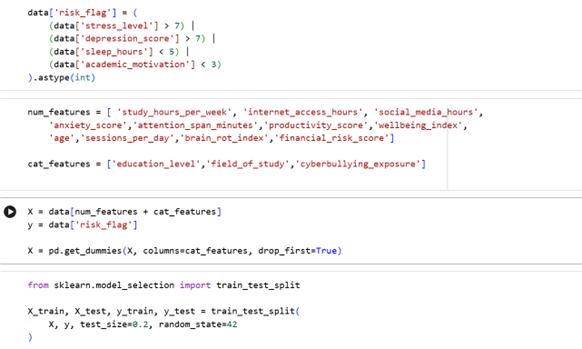

Define Target Variable: A new column called risk_flag was created to classify students based on stress level, depression score, sleep hours, and academic motivation.

Feature Selection: Important features such as study hours, social media usage, anxiety score, productivity score, wellbeing index, brain rot index, and cyberbullying exposure were selected for prediction analysis.

Data Encoding**:** Categorical variables were converted into numerical values using One-Hot Encoding.

Data Splitting**:** The dataset was divided into training and testing sets using an 80/20 ratio.

Model Training: Logistic Regression and Random Forest models were applied to predict student risk levels.

Model Validation: Model performance was evaluated using accuracy, confusion matrix, classification report, ROC Curve, and AUC Score.

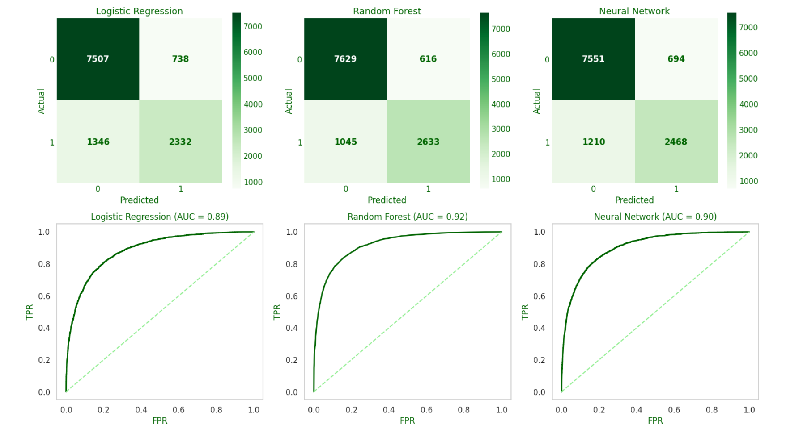

Model Results Explanation

Three machine learning models were implemented to predict students' academic and psychological risk levels:

- Logistic Regression
- Random Forest
- Neural Network

The models were evaluated using Accuracy, Precision, Recall, F1-Score, Confusion Matrix, ROC Curve, and AUC Score.

1\. Logistic Regression Results

- Accuracy: 82.5%
- AUC Score: 0.89

The Logistic Regression model achieved good overall classification performance and served as a strong baseline model.

Key Findings

- High recall for class 0 (low-risk students) = 0.91
- Lower recall for class 1 (high-risk students) = 0.63
- F1-score for high-risk students = 0.69

Confusion Matrix Analysis

- Correctly predicted low-risk students: **7507**
- Correctly predicted high-risk students: **2332**
- Misclassified high-risk students as low-risk: **1346**

Interpretation: The model performs well in identifying low-risk students but misses a larger number of high-risk students compared to other models.

2\. Random Forest Results

- Accuracy: 86.1%
- AUC Score: 0.92

Random Forest achieved the best overall performance among all models.

Key Findings

- Recall for high-risk students improved to 0.72
- Precision for high-risk students = 0.81
- F1-score for high-risk students = 0.76

Confusion Matrix Analysis

- Correctly predicted low-risk students: 7629
- Correctly predicted high-risk students: 2633
- Misclassified high-risk students as low-risk: 1045

Interpretation: The model successfully captured more complex relationships between academic behavior, mental health, and digital activity. It produced the highest prediction accuracy and better detection of high-risk students.

3\. Neural Network Results

- Accuracy: 84.0%
- AUC Score: 0.90

The Neural Network model also achieved strong performance and handled nonlinear relationships effectively.

Key Findings

- Recall for high-risk students = 0.67
- Precision for high-risk students = 0.78
- F1-score for high-risk students = 0.72

Confusion Matrix Analysis

- Correctly predicted low-risk students: 7551
- Correctly predicted high-risk students: 2468
- Misclassified high-risk students as low-risk: 1210

Interpretation: The Neural Network performed better than Logistic Regression but slightly lower than Random Forest in predicting high-risk students.

Quantitative Assessment

| Model               | Accuracy | Precision (Class 1) | Recall (Class 1) | F1-Score (Class 1) | AUC Score |
| ------------------- | -------- | ------------------- | ---------------- | ------------------ | --------- |
| Logistic Regression | 82.5%    | 0.76                | 0.63             | 0.69               | 0.89      |
| Random Forest       | 86.1%    | 0.81                | 0.72             | 0.76               | 0.92      |
| Neural Network      | 84.0%    | 0.78                | 0.67             | 0.72               | 0.90      |

Selected Model: Random Forest was selected as the final model.

Reasons for Selection

- Achieved the highest accuracy (86.1%)
- Produced the highest AUC Score (0.92)
- Had the best F1-score for high-risk students
- Reduced false negatives compared to other models
- Better captured complex relationships between:: Stress levels, Depression scores, Sleep behavior, Productivity, Social media usage, & Academic motivation

---

## *Clustering*

Clustering is an unsupervised machine learning technique used to group students with similar academic, behavioral, and mental health characteristics without predefined labels.

In this project, clustering was used to identify student groups based on study hours, sleep hours, social media usage, stress level, anxiety score, depression score, wellbeing index, and brain rot index.

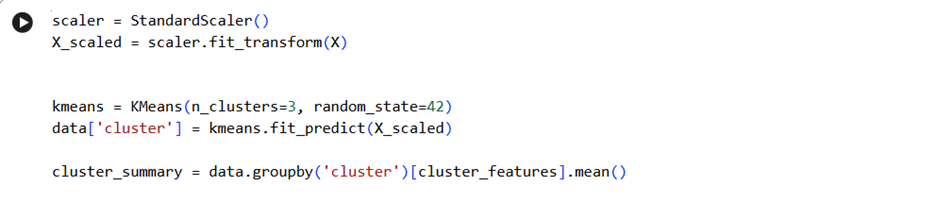
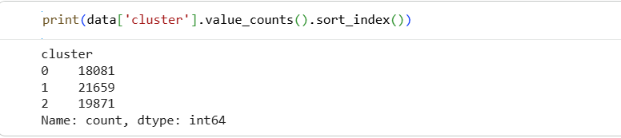

Select Relevant Features: Academic, mental health, and digital behavior variables related to student wellbeing and academic risk were selected for clustering analysis.

Normalize Data: StandardScaler was applied to standardize numerical variables and ensure equal contribution of all features during clustering.

Apply K-Means Clustering: The K-Means algorithm was implemented with 3 clusters to group students into distinct behavioral and psychological segments.

Assign Cluster Labels: Each student record was assigned to a cluster group to support segmentation and comparative analysis.

Analyze Cluster Results: Cluster averages were analyzed to identify high-stress students, balanced students, and students with higher digital addiction and brain rot levels.

These steps helped identify meaningful student segments and uncover hidden patterns related to stress, wellbeing, social media usage, sleep behavior, and academic risk.

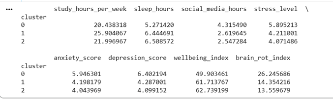

Cluster 0 - High Risk Students

- Lowest sleep hours (5.27 hours)
- Highest social media usage (4.31 hours)
- Highest stress, anxiety, and depression levels
- Lowest wellbeing index (49.9)
- Highest brain rot index (26.25)

Business Strategy

- Implement mental health counseling and psychological support programs
- Launch digital wellbeing and social media awareness campaigns
- Provide academic advising and stress management workshops
- Monitor high-risk students through early intervention systems
- Improve student wellbeing to reduce academic risk and poor performance

Cluster 1 - Healthy & Productive Students

- Highest study hours (25.9 hours)
- Good sleep quality (6.44 hours)
- Lower social media usage
- Lower stress, anxiety, and depression levels
- High wellbeing index (61.7)
- Lower brain rot index (14.35)

Business Strategy

- Maintain healthy academic and lifestyle behaviors through wellness programs
- Encourage participation in mentoring and leadership activities
- Use this cluster as a benchmark for positive student behavior
- Support productivity and long-term academic success initiatives

Cluster 2 - Balanced Students

- Moderate study hours (22 hours)
- Best sleep quality (6.51 hours)
- Lowest social media usage
- Lowest stress and anxiety levels
- Highest wellbeing index (62.7)
- Lowest brain rot index (13.56)

Business Strategy

- Promote balanced study-life habits and healthy digital behavior
- Encourage continuous wellbeing and academic support programs
- Maintain healthy sleep and productivity patterns through awareness campaigns
- Support preventive strategies to keep students in low-risk conditions

---

# **Tools Research and Selection Effort**

Several tools and technologies were used throughout the project to support student behavior analysis, machine learning, clustering, and dashboard visualization.

Python & Google Colab

Python was used within Google Colab for data preprocessing, exploratory data analysis, machine learning modeling, clustering analysis, and visualization. Libraries such as Pandas, NumPy, Scikit-learn, Matplotlib, and Seaborn supported tasks including Logistic Regression, Random Forest, Neural Networks, K-Means clustering, and model evaluation.

Power BI

Power BI was used to create interactive dashboards, KPIs, slicers, and visualizations related to academic risk, stress levels, productivity, social media usage, brain rot behavior, and student wellbeing analysis.

Together, these tools created a complete analytics workflow from data cleaning and predictive modeling to clustering analysis and interactive business intelligence reporting.

---

# *Project Deployment Effort - Use Case*

1\. Dashboard Monitoring and Educational Decision Support

The Power BI dashboards allow educational institutions to monitor:

- Academic risk levels
- Student stress, anxiety, and depression indicators
- Productivity and study behavior
- Social media usage and digital addiction patterns
- Student wellbeing and brain rot behavior

Educational institutions and counselors can quickly identify high-risk students and behavioral patterns that require attention and support.

2\. Prediction Models - Student Risk Forecasting

The machine learning models help predict students' academic and psychological risk levels using academic, behavioral, and mental health variables.

Business Uses

- Identify students at high academic and psychological risk
- Support early intervention strategies
- Improve student wellbeing and academic performance
- Support educational decision-making using predictive analytics
- Reduce the risk of poor academic outcomes and student burnout

The Random Forest model achieved higher prediction accuracy, while Logistic Regression provided more interpretable analytical insights.

3\. Student Segmentation - Clustering

Clustering was used to group students based on stress level, productivity, wellbeing, sleep behavior, social media usage, and brain rot indicators.

Business Applications

- Detect high-stress and high-risk student groups
- Identify students with excessive digital addiction behavior
- Support personalized academic and psychological support programs
- Improve student wellbeing and academic engagement strategies

Overall Business Value

- Dashboards answer: "What is happening?"
- Prediction models answer: "What may happen next?"
- Clustering answers: "Which student groups require attention?"

Together, these approaches improve student monitoring, academic support, mental wellbeing analysis, and educational decision-making.

---

# *Results*

The project showed that academic risk and student wellbeing are strongly influenced by stress levels, anxiety, depression, sleep behavior, social media usage, academic motivation, and brain rot behavior.

The Random Forest model achieved approximately 86% accuracy, outperforming Logistic Regression and Neural Network models in predicting student risk levels.

Clustering analysis identified important student segments such as:

- High-stress and high-risk students
- Healthy and balanced students
- Students with high digital addiction and brain rot behavior

Overall, the project demonstrates how Business Intelligence and AI techniques can transform student behavioral and mental health data into actionable insights that support smarter educational and wellbeing decisions.

---

# *References*

